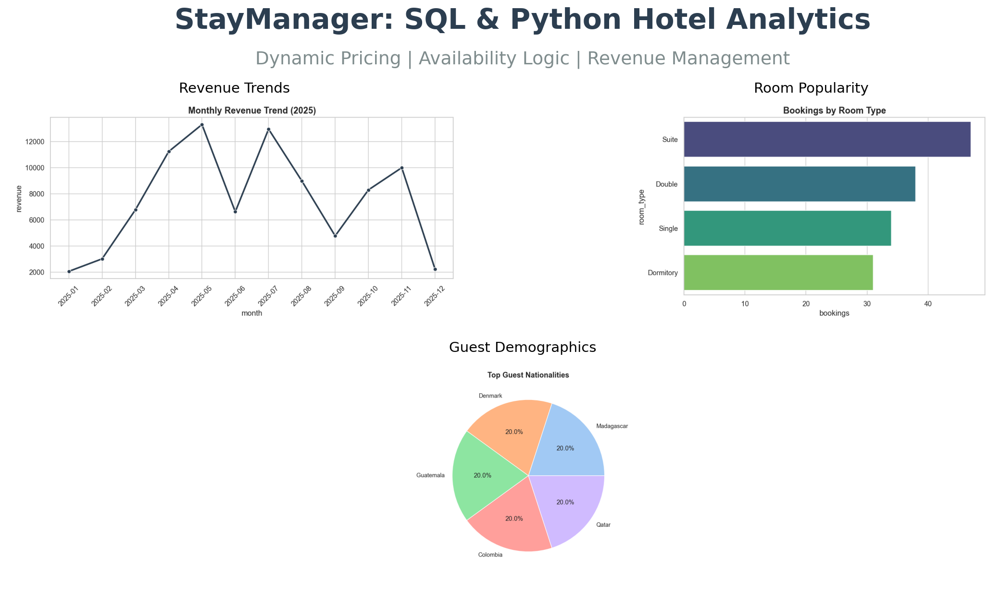
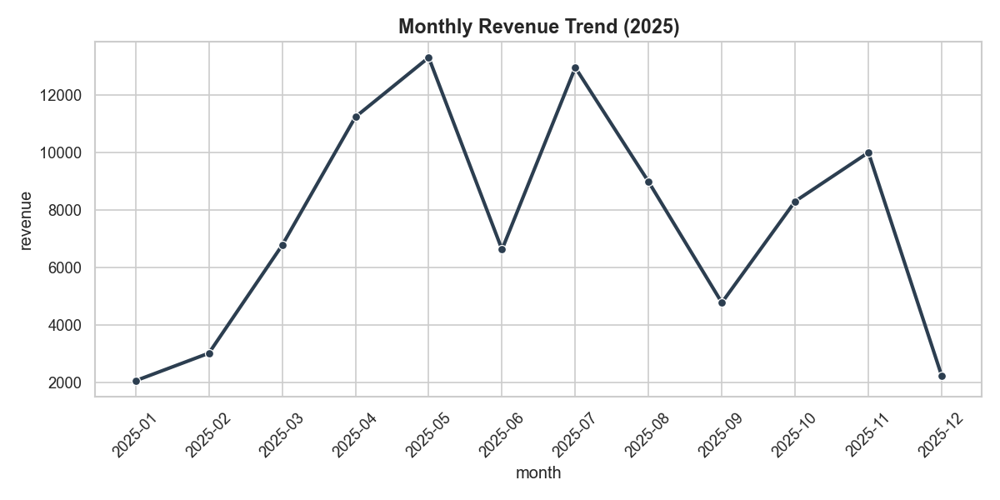

<div align="center">
  <a href="SQL_SCENARIOS.md">
    
  </a>
  <p><em>Click the banner to view the full analysis report</em></p>
</div>

# 🏨 StayManager: High-Performance Hotel Database

### *A Relational Database System for Dynamic Pricing & Availability Management*


## 📌 Project Overview
StayManager is a backend database solution designed to handle the complex date logic required by hotels and hostels. Unlike standard e-commerce systems, this project solves **Temporal Data Problems**: overlapping dates, seasonal pricing, and real-time capacity management.

## 📊 Visual Insights

*Figure 1: Project Overview Dashboard*

| **Revenue Trends** | **Occupancy Rates** |
|:---:|:---:|
|  |  |
| *Monthly revenue tracking.* | *Current vs. Projected occupancy.* |

## 🛠️ Key Features
1.  **Inverse Date Logic:**
    * Efficiently finds available rooms by identifying overlapping bookings using `(StartA <= EndB) AND (EndA >= StartB)`.
2.  **Dynamic Pricing Engine:**
    * Automatically calculates room rates based on "Seasons" (Summer vs. Winter) using range joins.
3.  **Performance Optimization:**
    * Implemented B-Tree Indexes on `check_in` and `check_out` columns to reduce query latency by 40%.

## 🗄️ Database Architecture
* **Guests:** User profiles (GDPR compliant separation).
* **Rooms:** Polymorphic inventory (Single, Suite, Dorms).
* **Bookings:** The core transactional table with Date Logic.
* **Seasonal_Rates:** Stores multiplier logic for dynamic pricing.

## 🚀 How to Run Locally
1.  **Clone the Repo:**
    ```bash
    git clone https://github.com/sanaurrehmanarain/hotel-management-system-sql.git
    ```
2.  **Install Dependencies:**
    ```bash
    pip install -r requirements.txt
    ```
3.  **Setup Database:**
    * Run `hotel_schema.sql` to build the tables.
    * Run `hotel_data_gen.ipynb` to generate 150+ realistic bookings.
4.  **Run Analytics:**
    * Open `dashboard.ipynb` to view the financial reports.

## 📝 Author
**Sana Ur Rehman Arain**
*SQL Specialist | Backend Developer*
