# 🏨 Hotel Management System: SQL Implementation & Results

> **Project:** StayManager Database  
> **Tech Stack:** MySQL, Python, Index Optimization

This document showcases the 20 complex SQL queries used to manage availability, pricing, and operations.

---

## 🛠 Part 1: Core Logic (Availability & Pricing)

### 1. Availability Check (Inverse Date Logic)

**Goal:** Find rooms free between specific dates by excluding overlapping bookings.

```sql
SELECT r.room_number, r.room_type, r.base_price
FROM rooms r
WHERE r.room_id NOT IN (
    SELECT b.room_id 
    FROM bookings b
    WHERE (b.check_in <= '2025-06-15') AND (b.check_out >= '2025-06-10')
    AND b.status != 'Cancelled'
);
```

**Output:**

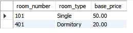

---

### 2. Seasonal Pricing Engine

**Goal:** Calculate dynamic price based on season (Summer/Winter).

```sql
SELECT 
    r.room_number,
    r.base_price AS standard_rate,
    sr.rate_name AS season,
    sr.multiplier,
    (r.base_price * sr.multiplier) AS seasonal_price
FROM rooms r
JOIN seasonal_rates sr 
    ON '2025-07-01' BETWEEN sr.start_date AND sr.end_date
WHERE r.room_type = 'Suite';
```

**Output:**

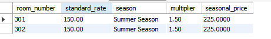

---

## 🛎 Part 2: Front Desk Operations

### 3. Today's Check-Ins

**Goal:** List of guests arriving on a specific date.

```sql
SELECT b.booking_id, g.first_name, g.last_name, r.room_number
FROM bookings b
JOIN guests g ON b.guest_id = g.guest_id
JOIN rooms r ON b.room_id = r.room_id
WHERE b.check_in = '2025-06-12';
```

---

### 4. Today's Check-Outs & Payment Status

**Goal:** Identify departing guests and verify if they have paid.

```sql
SELECT b.booking_id, g.last_name, r.room_number, 
       CASE WHEN p.amount >= b.total_price THEN 'Paid' ELSE 'Due' END AS payment_status
FROM bookings b
JOIN guests g ON b.guest_id = g.guest_id
JOIN rooms r ON b.room_id = r.room_id
LEFT JOIN payments p ON b.booking_id = p.booking_id
WHERE b.check_out = '2025-06-12';
```

---

### 5. Currently Occupied Rooms

**Goal:** List all rooms currently hosting a guest.

```sql
SELECT r.room_number, r.room_type, g.last_name, b.check_out
FROM bookings b
JOIN rooms r ON b.room_id = r.room_id
JOIN guests g ON b.guest_id = g.guest_id
WHERE '2025-06-12' BETWEEN b.check_in AND b.check_out;
```

**Output:**

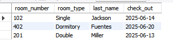

---

### 6. Guest Search (Partial Name)

**Goal:** Find guest details using a wildcard search.

```sql
SELECT guest_id, first_name, last_name, email, phone
FROM guests
WHERE last_name LIKE 'Smi%';
```

**Output:**

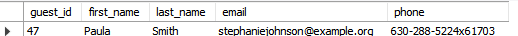

---

## 💰 Part 3: Revenue & Financials

### 7. Monthly Revenue Report

**Goal:** Track financial performance month-over-month.

```sql
SELECT 
    DATE_FORMAT(check_in, '%Y-%m') AS month,
    COUNT(booking_id) AS total_bookings,
    SUM(total_price) AS total_revenue
FROM bookings
WHERE status != 'Cancelled'
GROUP BY month
ORDER BY month;
```

**Output:**

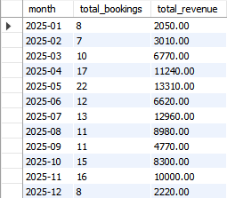

---

### 8. Average Daily Rate (ADR)

**Goal:** Calculate the average revenue earned per occupied room.

```sql
SELECT 
    r.room_type,
    ROUND(AVG(b.total_price / DATEDIFF(b.check_out, b.check_in)), 2) AS avg_nightly_rate
FROM bookings b
JOIN rooms r ON b.room_id = r.room_id
GROUP BY r.room_type;
```

**Output:**

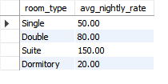

---

### 9. Revenue by Payment Method

**Goal:** Analyze preference for Credit Card vs. Cash.

```sql
SELECT method, SUM(amount) AS total_collected
FROM payments
GROUP BY method;
```

**Output:**

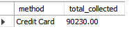

---

### 10. Top Revenue Generating Rooms

**Goal:** Identify the most profitable physical rooms.

```sql
SELECT r.room_number, SUM(b.total_price) AS revenue_generated
FROM bookings b
JOIN rooms r ON b.room_id = r.room_id
GROUP BY r.room_number
ORDER BY revenue_generated DESC
LIMIT 5;
```

**Output:**

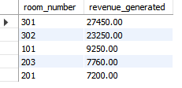

---

### 11. Cancellation Rate

**Goal:** Measure the percentage of bookings that are cancelled.

```sql
SELECT 
    (SELECT COUNT(*) FROM bookings WHERE status = 'Cancelled') * 100.0 / COUNT(*) AS cancellation_percentage
FROM bookings;
```

**Output:**

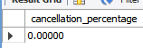

---

## 📊 Part 4: Strategy & Occupancy

### 12. Occupancy Rate by Room Type

**Goal:** Determine if Dorms or Suites are more popular.

```sql
SELECT 
    r.room_type,
    COUNT(b.booking_id) AS times_booked
FROM rooms r
LEFT JOIN bookings b ON r.room_id = b.room_id
GROUP BY r.room_type
ORDER BY times_booked DESC;
```

**Output:**

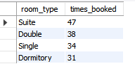

---

### 13. Long-Stay Guests (> 7 Days)

**Goal:** Identify long-term guests for loyalty rewards.

```sql
SELECT g.first_name, g.last_name, DATEDIFF(b.check_out, b.check_in) AS stay_duration
FROM bookings b
JOIN guests g ON b.guest_id = g.guest_id
WHERE DATEDIFF(b.check_out, b.check_in) > 7
ORDER BY stay_duration DESC;
```

**Output:**

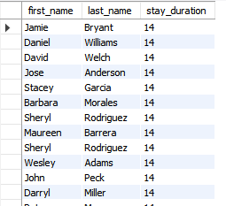

---

### 14. Average Lead Time

**Goal:** How many days in advance do guests book?

```sql
SELECT AVG(DATEDIFF(check_in, DATE(created_at))) AS avg_days_in_advance
FROM bookings;
```

**Output:**

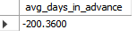

---

### 15. Peak Season Identification

**Goal:** Which month has the highest volume of check-ins?

```sql
SELECT MONTHNAME(check_in) AS month_name, COUNT(*) AS check_ins
FROM bookings
GROUP BY month_name
ORDER BY check_ins DESC
LIMIT 1;
```

**Output:**

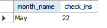

---

## 🧹 Part 5: Housekeeping & Demographics

### 16. Guest Nationality Breakdown

**Goal:** Demographics analysis for marketing.

```sql
SELECT nationality, COUNT(*) AS count
FROM guests
GROUP BY nationality
ORDER BY count DESC
LIMIT 5;
```

**Output:**

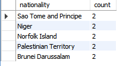

---

### 17. Repeat Guests (Loyalty)

**Goal:** Find guests who have booked more than once.

```sql
SELECT g.first_name, g.last_name, COUNT(b.booking_id) AS visits
FROM guests g
JOIN bookings b ON g.guest_id = b.guest_id
GROUP BY g.guest_id
HAVING visits > 1;
```

**Output:**

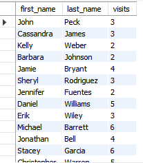

---

### 18. Housekeeping List (Departures)

**Goal:** List rooms that need cleaning tomorrow.

```sql
SELECT r.room_number, r.room_type
FROM bookings b
JOIN rooms r ON b.room_id = r.room_id
WHERE b.check_out = '2025-06-13';
```

**Output:**

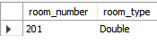

---

### 19. Room Maintenance Status

**Goal:** List rooms currently out of order.

```sql
SELECT room_number, status 
FROM rooms 
WHERE status = 'Maintenance';
```
---

### 20. "Orphaned" Rooms

**Goal:** Find rooms that have never been booked (Efficiency Check).

```sql
SELECT room_number, room_type 
FROM rooms 
WHERE room_id NOT IN (SELECT DISTINCT room_id FROM bookings);
```
---
